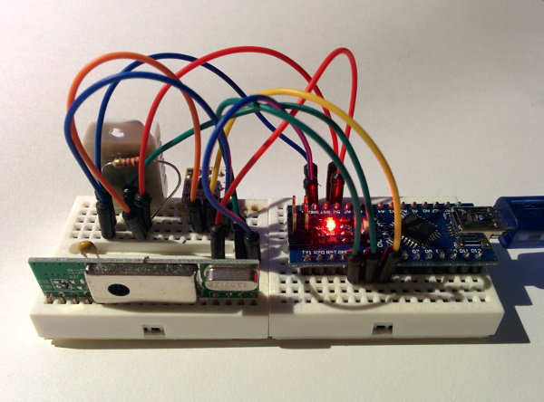

pimatic-homeduino
=======================

Plugin for using various 433mhz devices and sensors with a connected arduino with 
[homeduino](https://github.com/pimatic/homeduino) sketch or directly with capable hardware like the Raspberry Pi.

This plugins supports all 433mhz devices with [rfcontroljs](https://github.com/pimatic/rfcontroljs) 
[protocol implementations](https://github.com/pimatic/rfcontroljs/blob/master/protocols.md).


Drivers
------

The plugin can be used with two differend hardware combinations:

*  A. Computer with connected arduino (with homeduin sketch) and 433mhz transmitter and receiver (recommended)
*  B. Raspberry Pi (or Banana Pi or Hummingboard) with [ATTiny45 / 85 Prefilter](https://github.com/pilight/pilight_firmware#pinout) and 433mhz transmitter and receiver


### A.Connected arduino (recommended)

  

-------------
You can load the plugin by editing your `config.json` to include:

```json
{
  "plugin": "homeduino",
  "driver": "serialport",
  "driverOptions": {
    "serialDevice": "/dev/ttyUSB0",
    "baudrate": 115200
  },
  "receiverPin": 0,
  "transmitterPin": 4
}
```

in the `plugins` section. For all configuration options see [homeduino-config-schema](homeduino-config-schema.coffee)

The pin numbers are arduino pin numbers. The `receiverPin` must be either `0` (INT0) or `1` (INT1).
The `transmitterPin` can must bq a digitial pin between `2` (D2) and `13` (D13) .


### B. Raspberry Pi with ATTiny45 / 85 Prefilter

You can load the plugin by editing your `config.json` to include:

```json
{
  "plugin": "homeduino",
  "driver": "gpio",
  "driverOptions": {},
  "receiverPin": 0,
  "transmitterPin": 4
}
```

in the `plugins` section. For all configuration options see [homeduino-config-schema](homeduino-config-schema.coffee)

The pin numbers are [wiringPi pin numbers](http://wiringpi.com/pins/).

Devices
------

Devices must be added manually to the device section of your pimatic config. 

A list with all supported protocols and protocol-options can be found [here](https://github.com/pimatic/rfcontroljs/blob/master/protocols.md).

### weather-station sensor example:

```json
{
  "id": "rftemperature",
  "name": "Temperature",
  "class": "HomeduinoRFTemperature",
  "protocols": [{
    "name": "weather2",
    "options": {
      "id": 42,
      "channel": 1
    }
  }]
}
```

For protocol options see: 

### switch example:

```json
{
  "id": "rfswitch",
  "name": "RFSwitch",
  "class": "HomeduinoRFSwitch",
  "protocols": [{
    "name": "switch1",
    "options": {
      "id": 42,
      "unit": 0
    }
  }]
}
```

A switch (and other devcies) can be controled or send to outlets with multiple protocols. Just
add more protocols to the `protocols` array. You can also set if a protocols
is used for sending or receiving. Default is `true` for both.

### Multi protocol switch example:

```json
    {
      "id": "switchmp",
      "name": "Multi Switch",
      "class": "HomeduinoRFSwitch",
      "protocols": [
        {
          "name": "switch1",
          "options": {
            "id": 9509718,
            "unit": 0
          },
          "send": true,
          "receive": true
        },
        {
          "name": "switch1",
          "options": {
            "id": 9509718,
            "unit": 1
          },
          "send": false,
          "receive": true
        }
      ]
    }
```

### DHT11/22 sensor example:

```json
{
  "id": "homeduino-temperature",
  "name": "DHT",
  "class": "HomeduinoDHTSensor",
  "type": 22,
  "pin": 13
}
```

### PIR sensor example:

```json
{
  "id": "homeduino-pir",
  "name": "PIR",
  "class": "HomeduinoRFPir",
  "protocols": [{
    "name": "pir1",
    "options": {
      "unit": 0,
      "id": 17
    }
  }],
  "resetTime": 6000
}
```

### Contact sensor example:

```json
{
  "id": "homeduino-contact",
  "name": "Contact",
  "class": "HomeduinoRFContactSensor",
  "protocols": [{
    "name": "contact1",
    "options": {
      "unit": 0,
      "id": 42
    }
  }]
}
```


### Shutter sensor example:

*Can use switch protocols.*

```json
{
  "id": "homeduino-contact",
  "name": "Shutter Controller",
  "class": "HomeduinoRFShutter",
  "protocols": [{
    "name": "switch1",
    "options": {
      "unit": 0,
      "id": 42
    }
  }]
}
```


### Generic RF Sensor with arduino sender

```json
{
  "id": "homeduino-generic-sensor",
  "name": "RFGenericSensor",
  "class": "HomeduinoRFGenericSensor",
  "protocols": [{
    "name": "generic",
    "options": {
      "id": 42
    }
  }],
  "attributes": [
    {
      "name": "temperature",
      "type": 3,
      "decimals": 2,
      "baseValue": 0,
      "unit": "°C",
      "label": "Temperature"
    }
  ]
}
```

### Buttons Device example:

```json
{
  "id": "homeduino-buttons",
  "name": "Buttons",
  "class": "HomeduinoRFButtonsDevice",
  "buttons": [
    {
      "id": "test-button",
      "text": "test",
      "protocols": [{
        "name": "switch1",
        "options": {
          "unit": 0,
          "id": 42,
          "state": true
        }
      }]
    }
  ]
}
```

